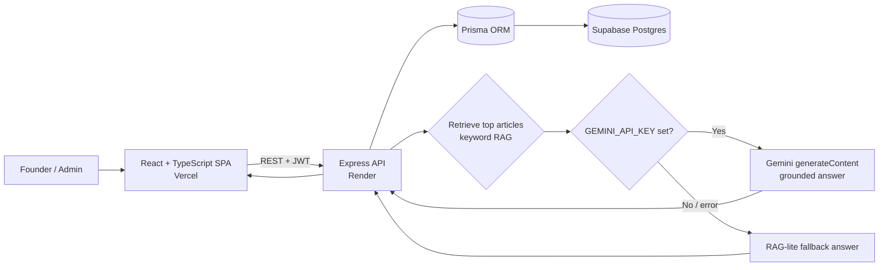

# Startup Navigator — Comprehensive Guide to Startups

Startup Navigator is a modern, AI-powered web app that helps entrepreneurs move from scattered
advice to structured execution across **company registration, funding, legal compliance, hiring,
branding, marketing, taxation, fundraising, AI tools, and business growth**.

It combines a curated startup knowledge base with an **AI search that answers questions using
retrieval + Google Gemini**, plus login, an admin CMS for content, saved search history, and an
analytics dashboard.

## Live Deployment

- **Live app (Vercel):** https://startup-navigator-three.vercel.app
- **API (Render):** https://startup-navigator-api.onrender.com
- **GitHub:** https://github.com/Pavan-Projects/startup-navigator

> The API runs on Render's free tier and sleeps after ~15 min of inactivity, so
> the first request after idle can take ~30–50s to wake. The UI shows loading states.

### Login credentials

| Role  | Email                          | Password      |
| ----- | ------------------------------ | ------------- |
| Admin | `admin@startupnavigator.com`   | `Admin@12345` |

Regular users can self-register from the **Login → Register** screen.

---

## Architecture



**Request flow for AI Search (RAG):**

1. Frontend `POST /api/search` with the user's question.
2. API tokenizes + expands the query, scores every published article, and retrieves the top 3.
3. Those articles are injected as grounded context into a Gemini `generateContent` call.
4. If Gemini is unavailable (no key, network error, quota), the **same retrieved sources** produce a
   deterministic keyword answer — so search **never breaks** for the user.
5. The question, answer, and cited sources are saved to `search_history` for dashboard stats and the
   user's personal history.

## Tech Stack

- **Monorepo:** pnpm workspaces + Turborepo (`apps/*`, `packages/*`)
- **Frontend:** React 18, TypeScript, Vite, lucide-react, hand-written CSS design system
- **Backend:** Node.js, Express, TypeScript, JWT auth, bcrypt, zod validation, express-rate-limit
- **Data:** Prisma ORM → Supabase Postgres
- **AI:** Google Gemini (`generateContent` REST API) with a keyword RAG-lite fallback
- **Deployment:** Vercel (web) + Render (API) + Supabase (DB) — all free tier

### Project layout

```
apps/
  web/     React SPA (pages, API client, design system)
  api/     Express REST API + RAG search + Gemini integration
packages/
  shared/  Shared TypeScript types + topic catalog (used by web and api)
  db/      Prisma schema, client, migrations, and seed script
```

## Features

- **Pages:** Home, Explore Topics, AI Search, Resources, About, Contact
- **Auth:** JWT login + self-service registration; role-based access (USER / ADMIN)
- **Admin CMS:** create / edit / delete articles and resources with live forms and validation
- **AI Search:** grounded Gemini answers with cited knowledge sources, example prompts, and
  clean markdown rendering
- **Search history:** every question is saved and viewable per-user
- **Dashboard:** users / articles / resources / searches counts, top questions, recent searches
- **UX polish:** responsive mobile-first layout, gradient hero, skeleton loaders, empty & error
  states, toasts, and a graceful offline/demo mode
- **Resilience:** if `VITE_API_URL` is unset the frontend runs entirely on a local demo dataset, and
  if Gemini is unreachable the API falls back to RAG-lite — the app is always usable.

## AI Tools Used

- **Google Gemini** (`gemini-2.5-flash` by default) for grounded answer generation via the
  `v1beta/models/{model}:generateContent` REST endpoint.
- **Claude Code** (Anthropic) as the AI coding assistant used to build, debug, and refactor the app.

### Representative prompts used during development

> Build a modern AI-powered web app "Startup Navigator" with Home, Explore, AI Search, Resources,
> About, and Contact pages, JWT login, an admin CMS for articles/resources, a retrieval-augmented
> AI search over a startup knowledge base, saved search history, and a stats dashboard. Responsive,
> production-ready, with loading and error states.

> Fix the Gemini integration: it was calling a non-existent `/v1beta/interactions` endpoint. Use the
> real `generateContent` REST API, pass a system instruction + grounded knowledge-base context, and
> parse `candidates[0].content.parts[].text`. Keep a keyword RAG-lite fallback when no key is set.

### Answer-generation system prompt (in `apps/api/src/search.ts`)

The model is instructed to ground answers in retrieved sources, stay actionable, avoid inventing
jurisdiction-specific legal/tax rules, and always return three markdown sections: **Answer**,
**What to do next** (numbered checklist), and **Sources used**.

---

## Local Development

```bash
pnpm install

# 1. Configure env (see below)
# 2. Generate Prisma client + run migrations + seed
pnpm --filter @startup-navigator/db db:generate
pnpm --filter @startup-navigator/db db:deploy
pnpm --filter @startup-navigator/db db:seed

# 3. Run web + api together
pnpm dev
```

- Frontend: `http://localhost:5173`
- API: `http://localhost:4000`

### Environment variables

`apps/api/.env`

```bash
PORT=4000
NODE_ENV=development
JWT_SECRET=change-this-in-production
CLIENT_URL=http://localhost:5173
DATABASE_URL="postgresql://...pooler...:6543/postgres?pgbouncer=true"
DIRECT_URL="postgresql://...:5432/postgres"
GEMINI_API_KEY=your-gemini-key         # optional; omit to use RAG-lite fallback
GEMINI_MODEL=gemini-2.5-flash
```

`apps/web/.env`

```bash
VITE_API_URL=http://localhost:4000     # omit to run in local demo mode
```

> **Security:** all `.env` files are gitignored. Never commit real keys. The values above are
> examples only.

---

## Deployment Process (Web = Vercel, API = Render)

### 1. Push to GitHub

```bash
git push origin main
```

### 2. Deploy the API to Render

1. New → **Blueprint** → connect this repo. Render reads `render.yaml` and provisions
   `startup-navigator-api`.
2. Set the `sync: false` secrets in the dashboard:
   - `DATABASE_URL`, `DIRECT_URL` — your Supabase pooler + direct URLs
   - `GEMINI_API_KEY` — your Gemini key
   - `CLIENT_URL` — your Vercel URL (add after step 3; can be a comma-separated list)
   - `JWT_SECRET` is auto-generated.
3. Deploy. Health check: `GET /health` → `{ "ok": true }`.

The build command (`pnpm build --filter @startup-navigator/api`) uses Turborepo to build
`shared` + `db` (running `prisma generate`) + `api` in dependency order.

Run the DB migration + seed once (Render Shell, or locally against the same DB):

```bash
pnpm --filter @startup-navigator/db db:deploy
pnpm --filter @startup-navigator/db db:seed
```

### 3. Deploy the web app to Vercel

1. New Project → import this repo. Vercel reads `vercel.json` (Vite framework, SPA rewrites).
2. Set env var **`VITE_API_URL`** = your Render API URL (e.g. `https://startup-navigator-api.onrender.com`).
3. Deploy. Then copy the Vercel URL back into Render's `CLIENT_URL` so CORS allows it.

### 4. Verify

- Login as admin → Dashboard loads with live stats.
- Create / edit / delete an article and a resource.
- Ask an AI Search question → grounded Gemini answer with cited sources.
- Register a user → confirm personal search history.
- Open on mobile width → no horizontal scroll.

> **Render free tier note:** the API sleeps after inactivity, so the first request after idle can
> take ~30–50s to wake. The frontend shows loading states and falls back gracefully.

## Testing Checklist

- [ ] Admin login + dashboard stats
- [ ] Article create / edit / delete
- [ ] Resource create / edit / delete
- [ ] AI Search returns a grounded answer with sources
- [ ] User register + personal history
- [ ] Mobile layout has no horizontal scroll
- [ ] `pnpm build` and `pnpm test` pass
