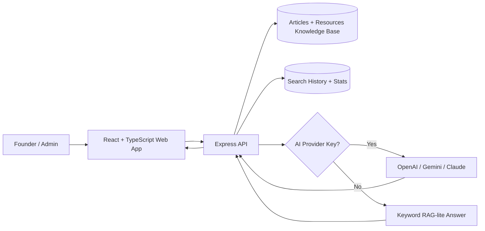

# Startup Navigator

Startup Navigator is a modern AI-assisted startup guidance app for entrepreneurs exploring registration, funding, legal compliance, hiring, branding, marketing, taxation, fundraising, AI tools, and growth.

## Live Deployment

Add after deployment:

- Live URL: `TBD`
- GitHub repository: `TBD`
- Admin login: `admin@startupnavigator.com`
- Admin password: `Admin@12345`

## Architecture



## Tech Stack

- Monorepo: pnpm workspaces + Turborepo
- Frontend: React, TypeScript, Vite, CSS, lucide-react
- Backend: Node.js, Express, TypeScript, JWT, bcrypt, zod
- AI search: pluggable design with a keyword-based RAG-lite fallback
- Deployment: Vercel/Netlify for frontend, Render/Railway for API

## Features

- Home, Explore Topics, AI Search, Resources, About, Contact
- Demo login and registration
- Admin section for article/resource CRUD
- AI Search with source citations and saved history
- Dashboard cards for users, articles, resources, and searches
- Loading, empty, and error states
- Responsive mobile-first UI

## Local Development

```bash
pnpm install
pnpm dev
```

Frontend: `http://localhost:5173`
API: `http://localhost:4000`

## Environment Variables

Create `apps/api/.env`:

```bash
PORT=4000
JWT_SECRET=change-this-in-production
CLIENT_URL=http://localhost:5173
OPENAI_API_KEY=
GEMINI_API_KEY=
GEMINI_MODEL=gemini-3.5-flash
CLAUDE_API_KEY=
```

Create `apps/web/.env`:

```bash
VITE_API_URL=http://localhost:4000
```

The frontend includes a local demo data adapter so the app remains usable even before a backend is deployed. The API supports Gemini-powered answers when `GEMINI_API_KEY` is set; otherwise it uses the built-in RAG-lite fallback.

## AI Tools Used

Built with Codex/ChatGPT in an iterative coding workflow. Representative prompt:

> Build and deploy a modern AI-powered web application called Startup Navigator with startup topics, login, admin CRUD, AI search, search history, dashboard stats, responsive UI, testing, deployment, and README.

## Deployment Process

1. Push this repository to GitHub.
2. Deploy `apps/web` to Vercel or Netlify.
   - Build command: `pnpm build --filter @startup-navigator/web`
   - Output directory: `apps/web/dist`
   - Env: `VITE_API_URL=<deployed-api-url>`
3. Deploy `apps/api` to Render or Railway.
   - Build command: `pnpm install && pnpm build --filter @startup-navigator/api`
   - Start command: `pnpm --filter @startup-navigator/api start`
   - Env: `JWT_SECRET`, `CLIENT_URL`, optional AI provider key.
4. Test admin login, CRUD, AI search, search history, and mobile layout.

## Testing Checklist

- Login as admin and verify dashboard access.
- Create, edit, and delete an article.
- Create, edit, and delete a resource.
- Ask an AI Search question and confirm cited sources appear.
- Register/login as a user and confirm personal search history.
- Visit on mobile width and confirm no horizontal scroll.
